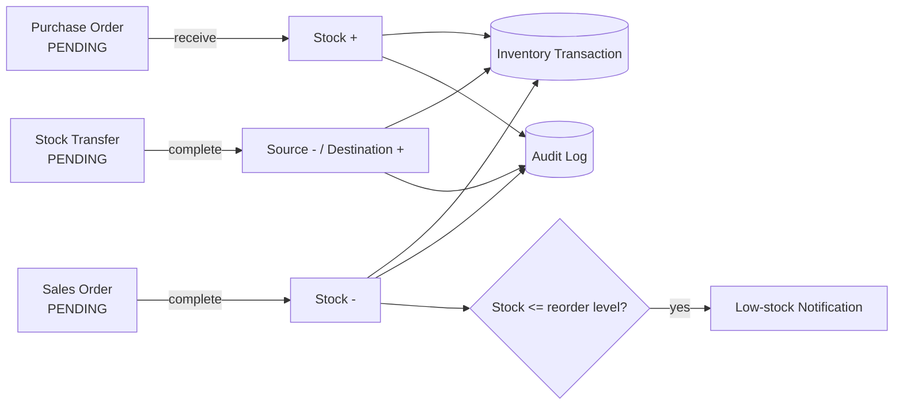

# StockFlow

**A full-stack inventory and supply chain management system.** StockFlow helps a business answer four everyday questions: *What do we have? Where is it? What do we need to reorder? What is selling?*

Built with **FastAPI + SQLAlchemy** (backend) and **React + Vite** (frontend).

---

## 1. The problem this solves

Small and mid-sized businesses often track stock in spreadsheets. That breaks down quickly:

- Nobody knows the real quantity in each warehouse.
- Stock runs out before anyone notices.
- There is no record of *who* changed *what*.
- Buying and selling aren't connected to the stock numbers.

StockFlow replaces this with one system where **every stock movement is tied to a real business event** (a purchase, a sale, a transfer) and is recorded automatically.

---

## 2. What it does

| Area | What you can do |
|---|---|
| **Authentication** | Log in with email and password. The API issues a JWT token, and every other endpoint requires it. |
| **Catalogue** | Manage Products (with unique SKU and reorder level), Categories, Suppliers and Customers. |
| **Warehouses** | Create multiple warehouses and track stock per product, per warehouse. |
| **Inventory** | See `quantity` and `reserved_quantity` for each product in each warehouse. |
| **Purchase Orders** | Order from a supplier. When the order is **received**, stock goes up automatically. |
| **Sales Orders** | Sell to a customer. When the order is **completed**, stock goes down automatically. |
| **Stock Transfers** | Move stock between two warehouses in one safe operation. |
| **Low-stock alerts** | If stock falls to or below a product's reorder level, a notification is created. |
| **Audit logs** | Important actions (receive, complete, etc.) are recorded with the user, action and time. |
| **Sales forecast** | Generates a predicted quantity per product from past sales history. |
| **Dashboard** | One-screen summary: totals for products, suppliers, customers, orders, units in stock and low-stock items. |

The frontend has a page for each of these (13 in total) plus a login screen.

---

## 3. How it works (the core idea)

The heart of the project is **stock never changes on its own.** It changes only through an order or transfer, and every change leaves a trail.



### Example: completing a sales order

1. The order is created with status `PENDING`. Totals are calculated on the server (`quantity x unit_price`), so the client can't fake them.
2. When "complete" is called, the server checks each item: `available = quantity - reserved_quantity`.
3. If any item doesn't have enough stock, the request is rejected with a clear error and nothing is changed.
4. Otherwise stock is reduced, a `SALE_OUT` transaction is written, a low-stock check runs, an audit log is added, and the order becomes `COMPLETED`, all in **one database commit**. Either everything happens or nothing does.

Purchase orders (`PURCHASE_IN`) and transfers (`TRANSFER_OUT` / `TRANSFER_IN`) follow the same pattern. A completed order can't be completed twice (this prevents double-counting stock).

---

## 4. Tech stack

| Layer | Technology | Why |
|---|---|---|
| API | **FastAPI** | Fast, type-checked, auto-generates interactive docs at `/docs` |
| Database access | **SQLAlchemy 2.0** | Models as Python classes, relationships, constraints |
| Database | **MySQL** (via PyMySQL) | Reliable relational database for transactional data |
| Migrations | **Alembic** | Versioned schema changes (10 migration files) |
| Validation | **Pydantic v2** | Every request and response has a defined shape |
| Auth | **JWT** (python-jose) + **bcrypt** (passlib) | Stateless login, hashed passwords |
| Frontend | **React 19** + **Vite** | Fast dev server, component-based UI |
| Linting | **Oxlint** | Frontend code quality |

---

## 5. Project structure

```
StockFlow/
├── backend/
│   ├── alembic/              # Database migrations (one per feature)
│   └── app/
│       ├── main.py           # App entry point, routers, CORS, admin seeding
│       ├── core/             # config (env vars), database engine, security (JWT, hashing)
│       ├── models/           # SQLAlchemy tables (21 models)
│       ├── schemas/          # Pydantic request/response shapes
│       ├── api/
│       │   ├── dependencies.py   # get_current_user (token check)
│       │   └── routes/           # One file per resource (CRUD + business actions)
│       └── services/         # Reusable business logic (auth, audit, low-stock, forecast, dashboard)
└── frontend/
    └── src/
        ├── App.jsx           # Layout, login state, page switching
        ├── components/       # Sidebar, Topbar
        ├── pages/            # One page + stylesheet per feature
        └── services/api.js   # Login API call
```

**Why it's organised this way:** routes handle HTTP, schemas validate data, models describe the database, and services hold logic reused in several places (e.g. the low-stock check is called from both sales orders and other flows). This keeps each file small and easy to find.

---

## 6. Database design

21 tables, grouped by purpose:

- **Access:** `users`, `roles`, `permissions`, `role_permissions`
- **Catalogue:** `categories`, `products`, `suppliers`, `supplier_products`, `customers`
- **Stock:** `warehouses`, `inventory`, `inventory_transactions`
- **Buying:** `purchase_orders`, `purchase_order_items`
- **Selling:** `sales_orders`, `sales_order_items`
- **Movement:** `stock_transfers`, `stock_transfer_items`
- **Insight:** `notifications`, `audit_logs`, `sales_forecasts`

Key design decisions:

- **`inventory` has a unique constraint on (product, warehouse)**, so the same product can't have two competing stock rows in one warehouse.
- **Orders have separate item tables**, so one order can contain many products.
- **`inventory_transactions` is an append-only history** (type, quantity, reference number, notes). The current quantity lives in `inventory`; the *reason* it changed lives in transactions.
- **`reserved_quantity`** separates "physically in the warehouse" from "promised to someone", and availability is always `quantity - reserved_quantity`.

---

## 7. API overview

Interactive docs are available at **http://127.0.0.1:8000/docs** once the server is running.

| Resource | Endpoints |
|---|---|
| Auth | `POST /auth/login` |
| Products, Categories, Suppliers, Customers, Warehouses, Supplier-products, Inventory | Full CRUD (`POST`, `GET`, `GET /{id}`, `PUT /{id}`, `DELETE /{id}`) |
| Purchase Orders | `POST /`, `GET /`, `GET /{id}`, `POST /{id}/receive` |
| Sales Orders | `POST /`, `GET /`, `GET /{id}`, `POST /{id}/complete` |
| Stock Transfers | `POST /`, `GET /`, `GET /{id}`, `POST /{id}/complete` |
| Inventory Transactions | `POST /`, `GET /`, `GET /{id}` |
| Notifications | `POST /`, `GET /`, `PUT /{id}/read` |
| Audit Logs | `POST /`, `GET /`, `GET /{id}` |
| Sales Forecasts | `POST /generate/{product_id}`, `POST /`, `GET /`, `GET /product/{id}` |
| Dashboard | `GET /dashboard/summary` |

All endpoints except login require a `Bearer` token.

### Validation built in

- Duplicate order / transfer numbers are rejected.
- Orders must contain at least one item; quantity must be above 0; price can't be negative.
- Referenced customers, suppliers, warehouses and products must exist (404 otherwise).
- A transfer's source and destination warehouses must be different.
- Reserved stock can't exceed total stock; stock can't go negative.

---

## 8. Running it locally

### Prerequisites
- Python 3.10+
- Node.js 18+
- A running MySQL server

### Backend

```bash
cd backend
python -m venv venv
source venv/bin/activate          # Windows: venv\Scripts\activate
pip install -r requirements.txt
```

Create `backend/.env`:

```env
DB_HOST=localhost
DB_PORT=3306
DB_USER=root
DB_PASSWORD=your_password
DB_NAME=stockflow
```

Create the database (`CREATE DATABASE stockflow;`), then apply migrations and start the server:

```bash
alembic upgrade head
uvicorn app.main:app --reload
```

The API runs at `http://127.0.0.1:8000`. On startup it automatically creates an `ADMIN` role and a default admin user.

### Frontend

```bash
cd frontend
npm install
npm run dev
```

Open **http://localhost:5173**.

### Default login (development only)

```
Email:    admin@stockflow.com
Password: admin123
```

Change this before any real deployment.

---

## 9. Honest limitations and next steps

I'd rather be upfront about what is and isn't finished. These are the next things I would work on:

| Current state | Planned improvement |
|---|---|
| Roles and permissions **tables exist**, but endpoints only check that the user is logged in, not what role they have | Enforce role-based access (e.g. only Admin can delete) |
| Forecasting uses a **simple average** of past order quantities per product | Time-series model (moving average / seasonality) using order dates |
| `POST /predict/url` is a **placeholder** endpoint | Remove it or implement a real feature |
| JWT secret and default admin password are **hardcoded** for development | Move secrets to environment variables, force password change |
| Low-stock alerts go to the first admin user | Notify all relevant users, per-user preferences |
| Orders have no cancel flow yet | Add `CANCEL` with reserved-stock release |
| Frontend switches pages with component state and calls the API with `fetch` in each page | Add React Router, a shared API client, and token-expiry handling |
| No automated tests | Add pytest tests for the order / transfer stock logic first, since that is the most critical code |
| CORS allows only `localhost:5173` | Make allowed origins configurable |

---

## 10. What I learned building this

- Designing a **relational schema** with real constraints, and managing it through **Alembic migrations** instead of editing tables by hand.
- Keeping **stock changes atomic**: validating everything first, then writing inventory, transactions, audit log and status in a single commit.
- Structuring a backend in layers (routes, schemas, models, services) so logic isn't duplicated.
- Securing an API with **hashed passwords and JWT tokens**.
- Connecting a **React** frontend to a REST API with authentication.

---

## Author

**Debojyoti** · [github.com/debojyoti0645](https://github.com/debojyoti0645)
